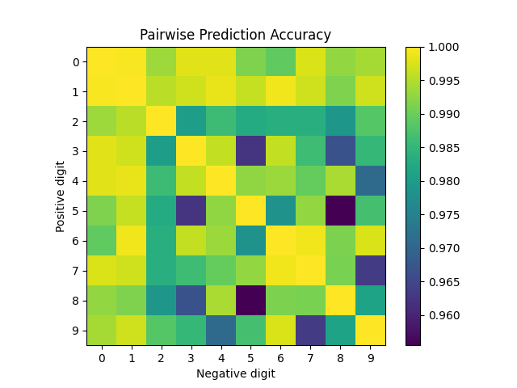
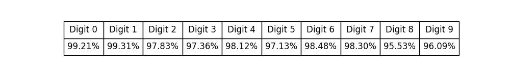

# Perceptron Linear Algorithm

## 1. Essentials
The Perceptron Linear Algorithm is a supervised learning algorithm used for binary classification introduced by Rosenblatt. The variables are:
- the inputs $x$: in the case of `MNIST`, these will be grayscale $28 \times 28$ images, 
- labels of the inputs $y$: for `MNIST` these are digits $0-9$, 
- and the weights $w$.

The weights are only updated when the prediction algorithm fails via the rule $\vec{w} \leftarrow \vec{w} + y (\vec{w} \cdot \vec{x})$ based on Rosenblatt's proposal. The idea is: When the perceptron fails, the prediction-label product is negative, 
$$$y (\vec{x} \cdot \vec{w}) < 0$$$,
so updating the weights at "pulls" the hyperplane in the direction necessary for the product to become positive. For any reasonable (not linearly separable) dataset, this will not converge.

## 2. Preparation
### Obtaining dataset
The MNIST dataset was obtained by cloning [a GitHub repo](https://github.com/fgnt/mnist). Yann Lecun's [copy of the dataset](http://yann.lecun.com/exdb/mnist/) was not available. The dataset is in the `idx` file format, and must be read byte by byte. The `dataset.py` script handles this.

### Digit selection and filtering
I have opted to make flexible code. 
For filtering: I did not create individual datasets for each digit. This might be optimal in the case of extremely large datasets, but for this one I believed it unnecessary. 
For digit selection: The code is somewhat modular, one can select any target digit and subset of digits to train against by modifying the boilerplate entry point in `training.py`. 

## 3. Code
If you are reading this `README.md` the code must be around here somewhere.

Decisions to note: 
The images were flattened for easier processing. This also meant that the bias term was integrated into the data and weights vector directly.

## 4. Accuracy
Accuracy was defined to be: "The ratio of correct predictions to the total predictions made on the validation set." After each training epoch, this ratio and corresponding weights were saved. Below are tables for pairwise accuracy and all vs. one accuracy. They were generated with the `analyze.py` script

## 5. Classification of all digits
The model which is most confident will have the highest prediction $x \cdot w$. One could train multiple "one vs. all" models (one for each digit), and predict the digit based on the highest confidence score. 