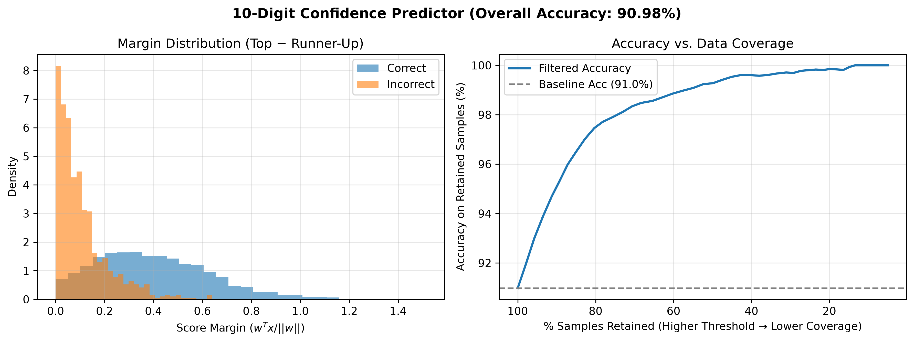

# Perceptron Linear Algorithm

## 1. Essentials
The Perceptron Linear Algorithm is a supervised learning algorithm used for binary classification introduced by Rosenblatt. The variables are:
- the inputs $\vec{x}$: in the case of `MNIST`, these will be grayscale $28 \times 28$ images, 
- labels of the inputs $y$: for `MNIST` these are digits $0-9$, 
- and the weights $\vec{w}$.

The weights are only updated when the prediction algorithm fails via the rule $\vec{w} \leftarrow \vec{w} + y (\vec{w} \cdot \vec{x})$ based on Rosenblatt's proposal. The idea is: When the perceptron fails, the prediction-label product is negative, 

$$
y (\vec{x} \cdot \vec{w}) \lt 0,
$$

so updating the weights at "pulls" the hyperplane in the direction necessary for the product to become positive. For any reasonable (not linearly separable) dataset, this will not converge.

## 2. Preparation
### Obtaining dataset
The MNIST dataset was obtained by cloning [a GitHub repo](https://github.com/fgnt/mnist). Yann Lecun's [copy of the dataset](http://yann.lecun.com/exdb/mnist/) was not available. The dataset is in the `idx` file format, and must be read byte by byte. The `dataset.py` script handles this.

### Digit selection and filtering
I have opted to make flexible code. 
For filtering: I did not create individual datasets for each digit. This might be optimal in the case of extremely large datasets, but for this one I believed it unnecessary. Instead, the training script filters for the selected digits before training.
For digit selection: The code is somewhat modular, one can select any target digit and subset of digits to train against by calling the `train()` function with the appropriate parameters (see example in boilerplate entry point at bottom of `training.py`)

## 3. Code
If you are reading this `README.md` the code must be around here somewhere. I have commented almost every set of lines and have also included soft-type checking in the functions' parameters and returns. This should in theory be well-documented.

Decisions to note: 
The images were flattened for easier processing. This also meant that the bias term was integrated into the data and weights vector directly.

## 4. Accuracy
Accuracy was defined to be: *"The ratio of correct predictions to the total predictions made on the validation set."* After each training epoch, this ratio and corresponding weights were saved. Below are tables for *pairwise accuracy* and *all vs. one accuracy*. They were generated with the `analyze.py` script, with the scores determined by taking the prediction ratio of the best-performing weights $\vec{w}$ during 100 epochs of training.

*Pairwise accuracy*, also known as the confusion matrix, tests pairs of digits against one another to probe how similar they are from the perspective of our architecture. Light squares represent digits that are not alike (except for diagonals, which are pathological), and dark squares represent the digits which are most alike. If it is not obvious why: the model should have high-accuracy in digits that are easy to differentiate and a low-accuracy in digits that are hard. 
- High-accuracy squares:
    - $0$ and $1$ are the digits which are least alike. This makes sense given both are easy to write (no strange handwriting for the model to handle) and are structurally disimilar. $6$ and $7$ are also not alike, which we assume by their opposite orientations. Surprisingly, $1$ and $4$ are also not alike, it is not completele clear to me why this is the case
- Low-accuracy squares:
    - $3, 8$ and $5$ are all alike. They are structurally similar numbers given that both $3$ and $5$ are some subset of lines from $8$. This can probably confused the model. $4$ and $9$ are also alike for similar reasons.

*All vs. one accuracy* tests each digit against all the others. One can infer how different one digit is from the rest by this metric from the perspective of our model. $0$ and $1$ are the least alike to the rest. I attribute this to the simplicity of how they are written in most cases, where bad handwriting may dominate mistakes in other predictions as well as subtleties the model needs to learn, this pair of digits combines well with our simple model. 

## 5. Classification of all digits
The model which is most likely will have the highest confidence $p = \vec{x} \cdot \vec{w} + b$ ($b$ is separate since we do not want to normalize the bias away). One could train multiple "one vs. all" models (one for each digit), and predict the digit based on the highest confidence score. We should normalize the confidence $p_n = \vec{x} \cdot \frac{\vec{w}}{\| w\|} + b$ such that identical planes with different magnitudes produce the same results, we are looking for the geometric distance between the prediction and the datapoint.

## 6. Implementation of all digits
The previously described extension is implemented directly in `analyze.py/confidence_eval` but a prototypic version of it can be found in `all_digits.py`. Two metrics are used to quantify the performance of this implementation, the *margin distribution* and the *accuracy vs. data coverage*. 

The *margin distribution* takes the difference between the best predictor and the runner-up, we color correct and wrong predictions in different colors. This metric is intended to show how robust the model is; ideally, wrong predictions would cluster near zero and correct predictions would have high margins. High margins would translate to a high-confidence prediction, rather than one that could have assigned a different digit if the weights were just slightly different.

The *accuracy vs. data coverage* metric tests the improvement of the model if added the third "uncertain" option to it. One can see that as we raise this threshold the overall acurracy increases, with improvements starting to plateau once we have decreased to keeping only 80% of predictions. Only at a sub-20% prediction threshold is there a near 100% certainty in the prediction.

